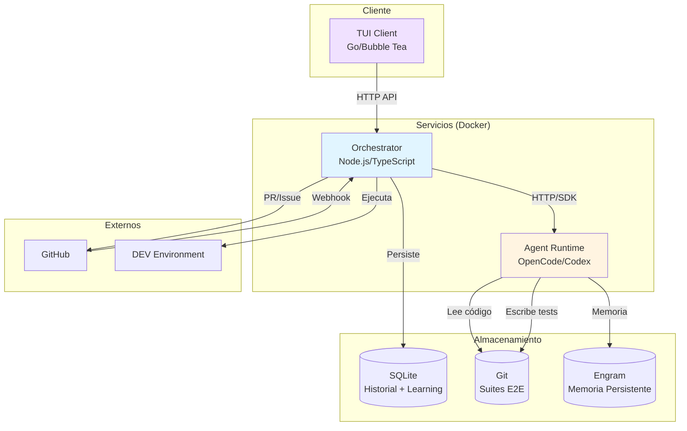
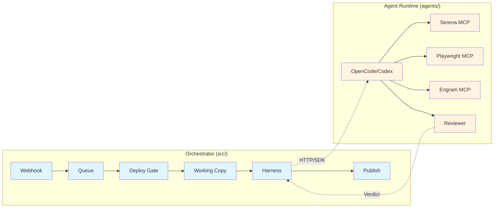
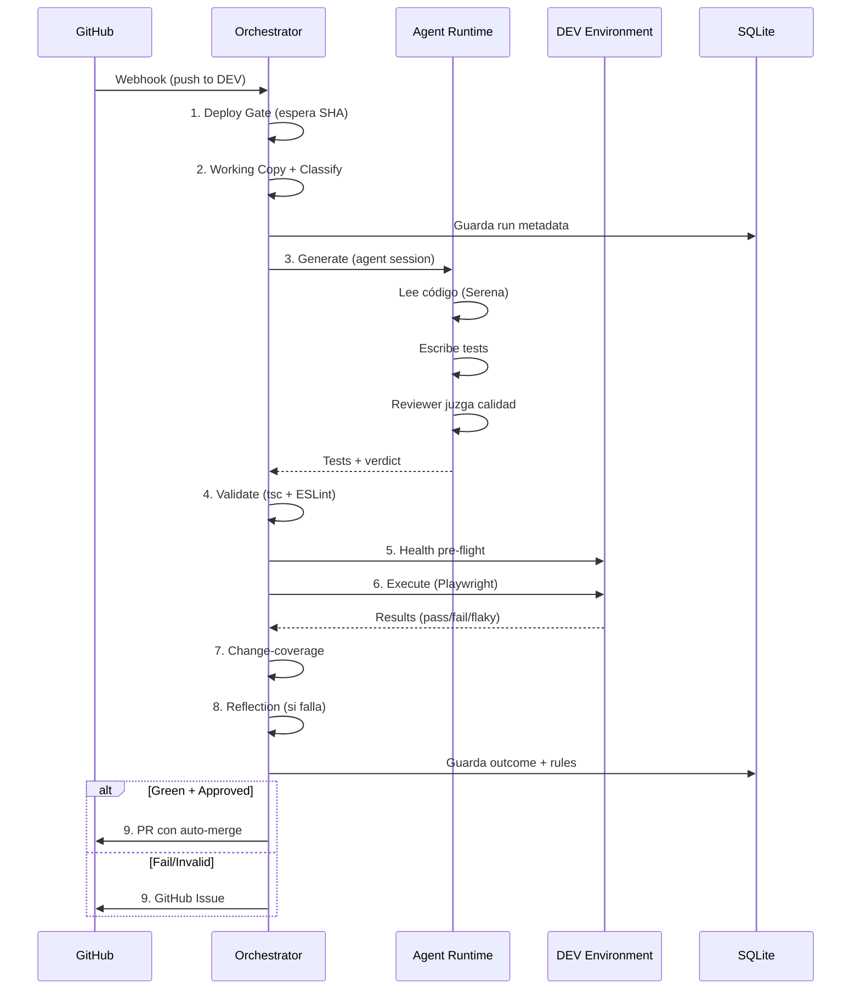
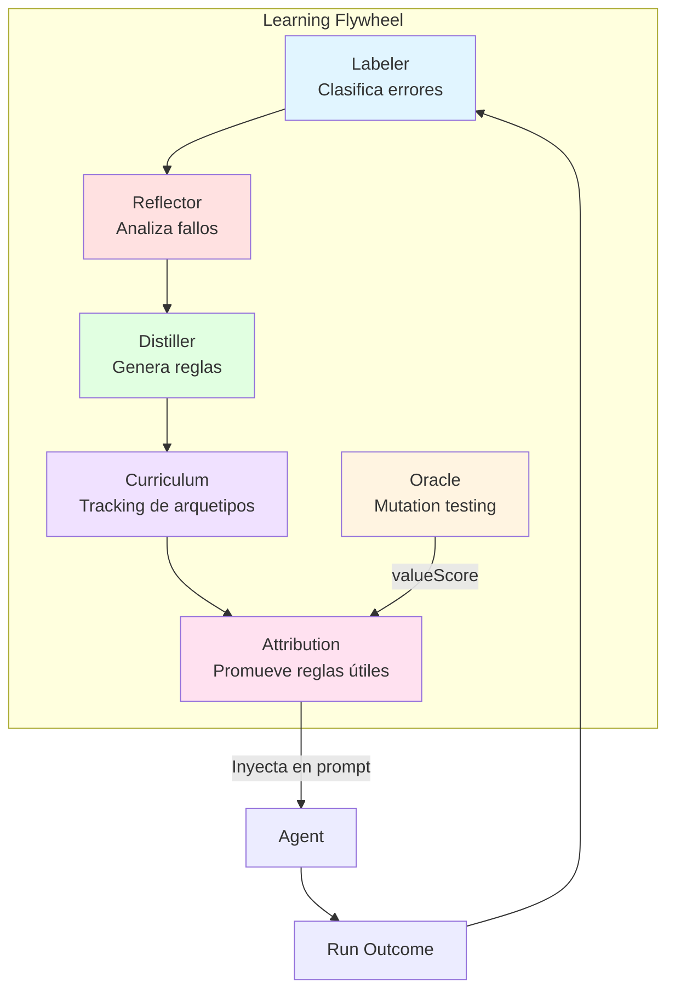
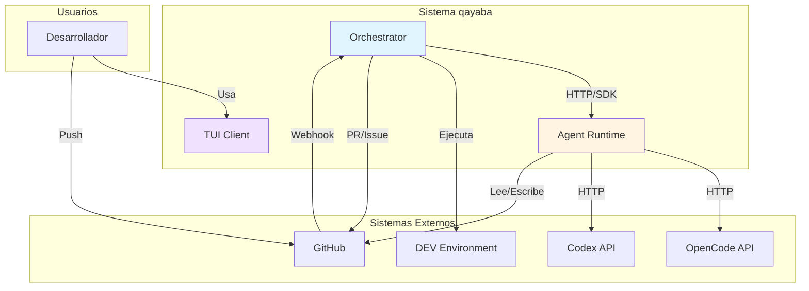

# Arquitectura del Proyecto qayaba

> **Documento de referencia rápida** para comprender la estructura, componentes y flujo de datos del sistema qayaba.
> 
> **Objetivo**: Que cualquier persona pueda entender qué hace cada carpeta y cómo interactúan los componentes en menos de 10 minutos.

---

## Tabla de Contenidos

- [1. Visión General](#1-visión-general)
- [2. Estructura de Carpetas](#2-estructura-de-carpetas)
- [3. Los Dos Servicios Principales](#3-los-dos-servicios-principales)
- [4. Flujo de Datos Completo](#4-flujo-de-datos-completo)
- [5. Componentes Clave](#5-componentes-clave)
- [6. Sistema de Aprendizaje](#6-sistema-de-aprendizaje)
- [7. Convenciones y Reglas](#7-convenciones-y-reglas)

---

## 1. Visión General

**qayaba** es un motor de QA E2E autónomo que:
- 👀 **Vigila** repositorios de tu equipo
- 🤖 **Genera** tests E2E con IA cuando hay un nuevo deploy
- ▶️ **Ejecuta** los tests contra el entorno DEV
- ✅ **Publica** PRs con los tests aprobados (o abre Issues si fallan)
- 🧠 **Aprende** de cada run para mejorar los siguientes

### Arquitectura de Alto Nivel



---

## 2. Estructura de Carpetas

### Mapa Visual del Proyecto

```
ai-pipeline/
│
├── 🤖 agent/                    # Prompts de agentes (PROVIDER-NEUTRAL)
├── 🎭 agents/                   # Runtime OpenCode + prompts legacy
├── ⚙️ src/                      # Shell determinístico (Orchestrator)
├── 🧠 qa-engine/                # Motor de QA hexagonal (lógica de negocio)
├── 💻 client/                   # TUI en Go/Bubble Tea
├── 📦 packages/                 # SDK + Web dashboard
├── 📋 contract/                 # OpenAPI spec del control plane
├── 📁 config/                   # Configuración de apps monitoreadas
├── 📚 docs/                     # Documentación técnica
├── 🔧 bin/                      # Scripts ejecutables
├── 🛠️ scripts/                  # Utilidades
└── 💾 data/                     # Runtime data (DB, logs)
```

### Descripción Detallada por Carpeta

#### 🤖 `../agent` - Prompts Provider-Neutral (FUTURO)

**Propósito**: Directorio canónico para prompts de agentes, independiente del proveedor (OpenCode, Codex, etc.)

| Archivo/Carpeta | Descripción |
|-----------------|-------------|
| `../AGENTS.md` | Instrucciones compartidas para todos los agentes |
| `roles/` | Prompts por rol: `qa-generator.md`, `qa-reviewer.md`, `qa-maintainer.md` |
| `skills/` | Conocimiento especializado bajo demanda:<br/>• `playwright-authoring/` - Cómo escribir specs robustos<br/>• `test-value-review/` - Catálogo de falsos positivos |

**Estado**: Es el futuro del sistema. `../agents` está en migración hacia aquí.

---

#### 🎭 `../agents` - Runtime OpenCode (PRESENTE)

**Propósito**: Configuración completa del runtime de agentes para OpenCode.

| Archivo/Carpeta | Descripción |
|-----------------|-------------|
| `opencode.json` | Configuración de agentes y MCPs (Serena, Engram, Playwright) |
| `../Dockerfile` | Imagen del contenedor de agentes |
| `agent-supervisor.mjs` | Supervisor que orquesta los agentes |
| `../agent` | Copia de los prompts (mantenida por compatibilidad) |
| `skill/` | Skills específicos de OpenCode |
| `smoke/` | Tests de humo |

**Relación con `../agent`**: `../agent` es el futuro, `agents/` es el presente. Están en migración.

---

#### ⚙️ `../src` - Shell Determinístico (Orchestrator)

**Propósito**: Toda la infraestructura **NO-IA** del sistema. Es el "cerebro determinístico" que orquesta todo.

```
src/
├── index.ts              # Entry point del webhook service
├── cli.ts                # CLI manual (npm run qa)
├── server/               # API, cola de trabajos, webhook, TUI, historial
│   ├── api.ts           # Endpoints HTTP del control plane
│   ├── queue.ts         # Cola secuencial de trabajos
│   ├── webhook.ts       # Receptor de webhooks de GitHub
│   ├── history.ts       # Persistencia SQLite de runs
│   ├── metrics.ts       # Métricas Prometheus
│   └── rewritten-engine-factory.ts  # Composition root (AppConfig → qa-engine)
├── integrations/         # Clientes HTTP externos
│   ├── opencode-client.ts  # Cliente HTTP de OpenCode SDK
│   ├── github.ts        # API de GitHub
│   └── publish.ts       # Publicación de PRs/Issues
├── orchestrator/         # Lógica de orquestación
│   ├── sanitizer.ts     # Sanitiza logs para Issues
│   └── config-loader.ts # Carga config/apps/*.yaml
└── agent-runtime/        # Abstracción del runtime de agentes
    ├── strategies.ts    # OpenCode/Codex strategies
    └── codex-strategy.ts
```

**Regla de oro**: `../src` **NUNCA** es importado por `qa-engine/` (verificado por dependency-cruiser)

---

#### 🧠 `../qa-engine` - Motor de QA Hexagonal

**Propósito**: El **corazón del sistema** - toda la lógica de QA siguiendo arquitectura hexagonal.

```
qa-engine/src/
├── contexts/
│   ├── qa-run-orchestration/     # El use case principal
│   │   ├── application/
│   │   │   ├── run-qa.use-case.ts  # ⭐ RunQaUseCase (leer primero)
│   │   │   └── ports/              # Ports hexagonales
│   │   └── infrastructure/
│   │       └── composition/        # Composition root
│   │
│   ├── generation/                 # Generación de tests con IA
│   │   ├── domain/                # Lógica de generación
│   │   └── infrastructure/        # Prompts, circuit-breaker, etc.
│   │
│   ├── test-execution/             # Ejecución de Playwright
│   │   ├── domain/                # Lógica de ejecución
│   │   └── infrastructure/        # Playwright runner, code runner
│   │
│   ├── workspace-and-publication/  # PRs, Issues, publicación
│   │   ├── domain/                # Lógica de publicación
│   │   └── infrastructure/        # Git operations
│   │
│   ├── objective-signal/           # Mutation testing (Stryker)
│   │   └── infrastructure/        # Stryker adapter
│   │
│   └── learning/                   # Sistema de aprendizaje
│       ├── domain/                # Rules, reflections, curriculum
│       └── infrastructure/        # SQLite repositories
│
├── shared-kernel/                  # Dominio compartido
│   ├── domain/                    # Entidades, value objects
│   └── ports/                     # Ports comunes
│
└── shared-infrastructure/          # Infraestructura compartida
    ├── code-graph/                # Análisis de código (Serena)
    └── process-sandbox/           # Sandbox de procesos
```

**Regla de oro**: `../qa-engine` **NUNCA** importa de `src/` (excepto vía inyección de dependencias)

---

#### 💻 `../client` - Cliente Go/Bubble Tea (TUI)

**Propósito**: Cliente de terminal interactivo escrito en Go con Bubble Tea.

```
client/
├── cmd/qayaba/              # Binario principal
│   └── main.go             # Entry point del CLI
├── internal/
│   ├── api/                # Cliente HTTP del control plane
│   │   ├── client.go      # HTTP client
│   │   ├── sse.go         # Server-Sent Events
│   │   └── auth.go        # Autenticación
│   ├── auth/               # OAuth GitHub device flow
│   │   └── device.go      # Device authorization
│   ├── store/              # Persistencia local
│   │   └── token.go       # Tokens, config
│   └── ui/                 # Bubble Tea TUI
│       ├── dashboard.go   # Vista principal
│       ├── live.go        # Live view de runs
│       ├── help.go        # Ayuda
│       └── ...            # Otras vistas
├── go.mod                  # Module: github.com/ArielFalcon/qayaba
└── Makefile                # Build e install del binario
```

**Comando**: `bin/qayaba` (wrapper que compila y ejecuta el cliente Go)

---

#### 📦 `../packages` - Monorepo de Paquetes

| Paquete | Descripción |
|---------|-------------|
| `sdk/` | SDK TypeScript (`@qayaba/sdk`) para consumir el control plane API |
| `../web` | Dashboard web (`@qayaba/web`) - slot preparado pero no implementado |

---

#### 📋 `../contract` - OpenAPI Spec

| Archivo | Descripción |
|---------|-------------|
| `openapi.json` | Especificación OpenAPI del control plane API |

**Uso**: Genera los tipos TypeScript para `@qayaba/sdk`

---

#### 📁 `../config` - Configuración de Apps

```
config/
├── apps/                    # Una config por app monitoreada
│   ├── portfolio.yaml      # App portfolio
│   ├── petclinic.yaml      # App petclinic
│   ├── jhipster-store.yaml # App jhipster-store
│   └── qayaba.yaml         # El propio qayaba (code mode)
├── e2e/                     # Seed de Playwright
│   ├── package.json        # Dependencies de Playwright
│   ├── fixtures.ts         # Fixtures compartidos
│   └── README.md           # Instrucciones
└── .api_token              # Token del control plane (auto-generado)
```

**Onboarding**: Copiar `../config/apps/example.yaml` y editar.

---

#### 📚 `` - Documentación Técnica

| Carpeta | Descripción |
|---------|-------------|
| `superpowers/` | Design docs, specs, planes de migración |
| `landing-page/` | Design brief para la landing page |
| `traspaso-conocimiento.md` | Documentación de handover |

---

#### 🔧 `../bin` - Scripts Ejecutables

| Script | Descripción |
|--------|-------------|
| `qayaba` | Wrapper del cliente Go (compila y ejecuta) |
| `qa` | Script interactivo para el control API |

---

#### 🛠️ `../scripts` - Scripts de Utilidad

| Script | Descripción |
|--------|-------------|
| `setup-branch-protection.sh` | Configura branch protection en GitHub |

---

#### 💾 `../data` - Datos en Runtime

| Archivo/Carpeta | Descripción |
|-----------------|-------------|
| `qayaba.db` | SQLite con historial de runs, learning rules, outcomes |
| `logs/` | Logs de ejecución |
| `backups/` | Backups automáticos de la DB |

---

## 3. Los Dos Servicios Principales

qayaba consta de **dos servicios Docker** que trabajan juntos:

### Servicio 1: Orchestrator (`../src`)

**Responsabilidad**: Infraestructura **determinística**

| Función | Descripción |
|---------|-------------|
| 📨 Webhook | Recibe eventos de GitHub |
| 📋 Cola | Gestiona trabajos secuenciales |
| 🚦 Deploy Gate | Espera a que DEV tenga el SHA correcto |
| 📂 Working Copy | Clona/checkout repos |
| ✅ Harness | Valida y ejecuta tests |
| 📢 Publish | Crea PRs/Issues en GitHub |
| 📊 Metrics | Expone métricas Prometheus |

**Tecnologías**: Node.js, TypeScript, SQLite

---

### Servicio 2: Agent Runtime (`../agents`)

**Responsabilidad**: Motor **agéntico** (IA)

| Función | Descripción |
|---------|-------------|
| 🤖 Agentes | Ejecuta OpenCode/Codex |
| 🔍 Serena MCP | Navegación semántica de código |
| 🎭 Playwright MCP | Browser real para tests E2E |
| 🧠 Engram MCP | Memoria persistente |
| 👀 Reviewer | Segundo modelo que revisa calidad |

**Tecnologías**: OpenCode, Codex, MCP servers

---

### Comparación Visual



---

## 4. Flujo de Datos Completo

### Pipeline de QA (Modo `diff`)



### Pasos Detallados

| # | Paso | Descripción | Resultado |
|---|------|-------------|-----------|
| 1 | **Deploy Gate** | Espera a que DEV sirva el SHA correcto | `infra-error` si timeout |
| 2 | **Classify** | Lee commit message + diff (Conventional Commits) | `skip` si es solo estilo |
| 3 | **Setup** | Copia seed `../config/e2e` → repo's `e2e/`, `npm ci` | - |
| 4 | **Generate** | Agente lee blast radius, escribe tests, invoca reviewer | Tests en `e2e/` |
| 5 | **Validate** | `tsc` + ESLint + `playwright --list` + manifest | `invalid` si falla |
| 6 | **Health** | Verifica que DEV está up | `infra-error` si down |
| 7 | **Execute** | Playwright contra DEV URL | `pass`/`fail`/`flaky` |
| 8 | **Coverage** | Mide si tests cubren líneas del diff | `signal`/`enforce` |
| 9 | **Decide** | Green + approved → PR, fail → Issue | PR o Issue |

---

## 5. Componentes Clave

### 5.1 RunQaUseCase - El Corazón

**Ubicación**: `../qa-engine/src/contexts/qa-run-orchestration/application/run-qa.use-case.ts`

**Propósito**: Es el **único** use case del sistema. Tanto el webhook como el CLI pasan por aquí.

```typescript
// Simplificado
class RunQaUseCase {
  async run(options: RunOptions): Promise<RunOutcome> {
    await this.gate(options.sha);           // 1. Deploy gate
    const { diff, classification } = ...;   // 2. Classify
    await this.setup(options.app);          // 3. Setup
    const tests = await this.generate(...); // 4. Generate
    await this.validate(tests);             // 5. Validate
    await this.healthCheck(options.app);    // 6. Health
    const result = await this.execute(...); // 7. Execute
    const coverage = await this.coverage(); // 8. Coverage
    return this.decide(result, coverage);   // 9. Decide
  }
}
```

---

### 5.2 Dependency Injection - La Estrategia de Testing

**Principio**: Cada paso con side-effects es inyectado vía **ports hexagonales**.

```typescript
// Ports (interfaces)
interface RunQaUseCaseDeps {
  gate: GatePort;
  classify: ClassifyPort;
  setup: SetupPort;
  generate: GeneratePort;
  validate: ValidatePort;
  execute: ExecutePort;
  publish: PublishPort;
}

// Tests usan fakes
const fakeDeps: RunQaUseCaseDeps = {
  gate: fakeGatePort(),
  // ... todos fake
};

const useCase = new RunQaUseCase(fakeDeps);
```

**Beneficio**: La lógica de orquestación está 100% testeada con stubs. Las integraciones reales son los boundaries deliberadamente no-cubiertos.

---

### 5.3 Agentes - Tres Roles, Dos Modelos

| Rol | Modelo | Herramientas | Propósito |
|-----|--------|--------------|-----------|
| `qa-generator` | `deepseek-v4-pro` | read, edit, bash | Escribe tests |
| `qa-reviewer` | `qwen3.7-max` | read-only | Juzga calidad |
| `qa-maintainer` | `deepseek-v4-pro` | read, edit, bash | Self-repair del repo |
| `qa-assistant` | `deepseek-v4-flash` | none | Q&A de runs (TUI) |

**Independencia**: Dos modelos diferentes garantizan juicio independiente.

---

### 5.4 Modos de Ejecución

| Modo | Descripción | Cuándo usar |
|------|-------------|-------------|
| `diff` (default) | Testea blast radius de un commit | Webhook-triggered |
| `complete` | Analiza repo completo, genera para flujos no cubiertos | Llenar gaps |
| `exhaustive` | Re-evalúa TODO y regenera suite completa | Auditoría completa |
| `manual` | Generación guiada por `--guidance` | Testing focalizado |

---

### 5.5 Targets de Ejecución

| Target | Descripción | Ejemplo |
|--------|-------------|---------|
| `e2e` (default) | Playwright contra DEV URL | Tests de UI |
| `code` | Test runner del repo (sin browser) | Tests unitarios/integración |

**Code mode**: El repo se testea a sí mismo (`code: true` en config)

---

## 6. Sistema de Aprendizaje

qayaba aprende de cada run para mejorar los siguientes.

### Componentes del Learning System



| Componente | Función |
|------------|---------|
| **Labeler** | Clasifica cada run en error class (E-STATIC, E-EXEC-FAIL, etc.) |
| **Oracle** | Mutation testing (Stryker) - mide cuántos bugs inyectados detectan los tests |
| **Reflector** | LLM analiza errores y produce reglas preventivas |
| **Distiller** | Convierte reflexiones en reglas reutilizables |
| **Curriculum** | Tracking de arquetipos que han caught bugs reales |
| **Attribution** | Reglas con mejor successRate son promovidas |

---

## 7. Convenciones y Reglas

### Reglas de Arquitectura

| Regla | Descripción |
|-------|-------------|
| **`../qa-engine` nunca importa `src/`** | Verificado por dependency-cruiser (`npm run arch:check`) |
| **`../src` es el shell permanente** | Composition root, control plane, provider I/O, persistence |
| **DI es la estrategia de testing** | Todo side-effect es inyectado vía ports |
| **Suites viven en git** | `e2e/` en el repo de la app, versionado y reviewable |
| **engram es la única data no-regenerable** | Serena index y working copies son caches |

### Comandos Esenciales

```bash
# Desarrollo
npm install                 # Instalar dependencias
npm test                    # Tests unitarios (900+ tests)
npm run typecheck           # TypeScript strict check
npm run arch:check          # Verificar reglas de arquitectura

# Ejecución manual
npm run qa -- --app <app> --sha <sha>
npm run qa -- --app <app> --mode exhaustive
npm run qa -- --app <app> --mode manual --guidance "..."

# Docker
doppler run -- docker compose up --build
docker compose up --build

# Cliente Go
bin/qayaba                  # TUI interactivo
```

### Variables de Entorno Clave

| Variable | Descripción |
|----------|-------------|
| `OPENCODE_API_KEY` | API key de OpenCode (prefijo `opencode-go/`) |
| `CODEX_API_KEY` | API key de Codex/OpenAI |
| `GITHUB_TOKEN` | Token de GitHub para PRs/Issues |
| `WEBHOOK_SECRET` | Secreto para validar webhooks |
| `QA_API_TOKEN` | Token del control plane (auto-generado) |
| `QAYABA_ROOT` | Root del proyecto (default: cwd) |

---

## 8. Glossary

| Término | Definición |
|---------|------------|
| **Blast radius** | Alcance del cambio - qué código puede estar afectado |
| **Shadow mode** | Modo de prueba: pipeline completo pero sin PRs/Issues |
| **Change-coverage** | Métrica de si los tests cubren las líneas del diff |
| **valueScore** | Score de mutation testing - cuántos bugs detectan los tests |
| **Verdict** | Resultado final: `pass`, `fail`, `flaky`, `invalid`, `infra-error`, `skipped` |
| **Working copy** | Copia local del repo en el volumen Docker |
| **Seed** | Config inicial de Playwright que se copia a los repos |

---

## 9. Recursos Adicionales

| Recurso | Ubicación |
|---------|-----------|
| **README principal** | `../README.md` |
| **Guía operativa** | `../CLAUDE.md` |
| **Instrucciones de agentes** | `../AGENTS.md` |
| **Design docs** | `superpowers` |
| **Configuración de apps** | `config/apps/*.yaml` |

---

## 10. Diagrama de Contexto C4



---

**Última actualización**: 2026-09-07  
**Versión del documento**: 1.0
